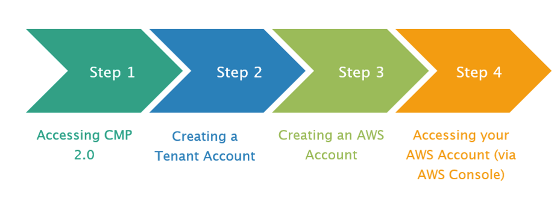

# About GCC 2.0

The GCC platform is now redesigned to be more user-centric, and this facilitates easy and quick adoption of commercial cloud solutions provided by the leading cloud service providers such as AWS, Azure and Google Cloud.

Based on the feedback from the initial government commercial cloud platform - GCC 1.0 users, and also with our key learning points over the past two years, we have improved GCC 1.0.

GCC 2.0 leverages more on the existing cloud-native capabilities and aligns with the cloud security practices. The cutting-edge cloud solutions enable the engineers to deliver government digital services faster, cost-effectively, and securely.

Key features of GCC 2.0:

- [Simplified onboarding process](#simplified-onboarding-process)
- [Automated workflows](#automated-workflows)
- [Enhanced cyber security](#enhanced-cyber-security)
- [Reduced cost](#reduced-cost)
- [Improved observability, auditability and monitoring](#improved-observability-auditability-and-monitoring)
- [Continuous compliance](#continuous-compliance)
- [Remote administration](#remote-administration)
- [Continuous log export and retention capability](#_Continuous_log_export)

## Simplified onboarding process
We have streamlined the GCC onboarding with the recent improvements and made the onboarding experience on par with the standard industry practice. Users can start onboarding to GCC 2.0 with a single user account, your [TechPass](https://docs.developer.tech.gov.sg/docs/techpass-user-guide/#/) account. The onboarding time has been reduced from 4 weeks to less than a week with the following four steps. Simplified onboarding enables engineers to come on board quickly and start their development activities immediately.

>- **Prerequisite(s) to onboard GCC 2.0:**
>- [TechPass](https://docs.developer.tech.gov.sg/docs/techpass-user-guide/#/) which is the identity and access management service.
>- To access government engineering resources from your internet device, enrol the device with [SEED](https://docs.developer.tech.gov.sg/docs/security-suite-for-engineering-endpoint-devices/#/) for secured access.  

## Automated workflows

The workflow for creating tenant accounts, CSP accounts and managing cloud users are automated now, shortening the turnaround time and eliminating the need to create service request. Further, agencies need not apply for a dedicated single mail account for each cloud account.

## Enhanced cyber security

Public officers can access the government engineering resources from their GSIB devices. However, if they want to access these resources from their internet device, they need to enrol the device with SEED.

When you onboard your internet device to SEED,  it becomes a Government Managed Device (GMD). SEED provides greater visibility of the endpoints leading to continuous, real-time security posture analysis. It is a paradigm shift from the traditional perimeter-based security model to the Zero Trust model.

If a non-compliant device tries to access the government engineering resources, SEED automatically revokes the access for this device. End-to-end encryption is available for the transactions between the GMD and the hosted service.

## Reduced cost

Strategies such as re-engineering the GCC platform to streamline GCC onboarding, automating the workflows of tenant account and CSP account provisions and using cloud-native solutions reduce the overall expense incurred.

For example, in GCC 2.0, Jumphosts are replaced with cloud-native solutions such as [Session Manager](https://gccprod-my.sharepoint.com/https:/docs.aws.amazon.com/systems-manager/latest/userguide/session-manager.html) and [Fleet Manager](https://docs.aws.amazon.com/systems-manager/latest/userguide/fleet.html) for Linux and Windows workloads. All these translate into higher productivity and savings in the workforce as engineers can deliver in a shorter turnaround time.

## Improved observability, auditability and monitoring

With the Policy-as-Code approach, we define, update, share and enforce policies as code. All the resources we provide, by default, will have a policy compliance check. This checking happens in real-time to check for security vulnerabilities. The policy-as-code defines the identity used to access your CSP console or dashboard. Cloudflare Access Control determines who can access the government engineering resources by applying the access control policies and replacing the need for VPNs.

## Continuous compliance

We have used a *Light-touch* approach with cloud-native solutions. We use native solutions such as [AWS Config](https://aws.amazon.com/config/) to achieve continuous compliance. By default, all the resources we provision have a policy compliance check. As we define policies as codes, it reduces the latency in security assessments. In other words, it is possible to evaluate the compliance state of cloud workloads quickly, and the resource configuration changes are detected earlier. Services such as [EventBridge](https://aws.amazon.com/eventbridge/) help detect specific user activities.

## Remote administration

Native solutions from CSPs enable remote administration to manage, access, and troubleshoot cloud resources, including Elastic Compute Cloud instances and virtual machines. They provide a consistent way to gather operational insights, carry out routine management tasks, track your development, test and production environments and proactively act on events or active incidents.

For example, [AWS Systems Manager](https://docs.aws.amazon.com/systems-manager/latest/userguide/what-is-systems-manager.html) with [SSM Agent](https://docs.aws.amazon.com/systems-manager/latest/userguide/ssm-agent.html) allows remote administration such as SSH terminal remote administration and RDP remote administration with Fleet Manager, configuration management, patching operating systems and execute Policy-as-Code inspections.

## Continuous log export and retention capability

In GCC 2.0, it is possible to collate logs and findings from your cloud services and export them to a centralised location such as the Log S3 bucket on the core login account. Authorised users from agencies can access your cloud account logs and findings from this centralised location.

**Additional resources**:

- [GCC 2.0 User Documentation](https://docs.developer.tech.gov.sg/docs/gcc-version-2-user-documentation/#/)
- [GCC 2.0 Workshops](https://docs.developer.tech.gov.sg/docs/gcc-20-workshops/#/)
- [GCC 2.0 Tech Talks](https://docs.developer.tech.gov.sg/docs/gcc-2-tech-talks/#/)
- [General GCC 2.0 Information](https://sgdcs.sgnet.gov.sg/sites/tech/SNDigiGov/CentralICTServices/MHI/Pages/GCC-2.0.aspx)

?>Note: Users can access some resources in the above links only from a GSIB device.
